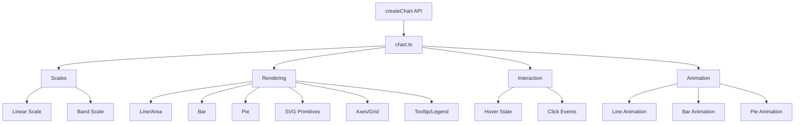

# Critical Code Review: SWP Charting Library

I've conducted a comprehensive review of the TypeScript codebase for the SWP Charting library. Below is my critical analysis organized by key areas.

## 📊 Architecture Overview



## ✅ Strengths

### 1. **Excellent Type Safety**
- Comprehensive type definitions in [`types.ts`](src/types.ts:1)
- Proper use of TypeScript strict mode in [`tsconfig.json`](tsconfig.json:28)
- Good use of discriminated unions and optional chaining

### 2. **Clean Separation of Concerns**
- Clear module boundaries (scales, rendering, animation, interaction)
- Each module has a single responsibility
- Good functional programming approach

### 3. **Zero Dependencies**
- Pure TypeScript/JavaScript implementation
- No external charting library dependencies

### 4. **Good Developer Experience**
- Clean public API via [`index.ts`](src/index.ts:1)
- Reasonable defaults throughout

## 🔴 Critical Issues

### 1. **Memory Leaks in Event Listeners**

**Location:** [`chart.ts:221-225`](src/chart.ts:221-225)

```typescript
const destroy = (): void => {
  hoverArea.removeEventListener('mousemove', handleMouseMove);
  hoverArea.removeEventListener('mouseleave', handleMouseLeave);
  hoverArea.removeEventListener('click', handleClick);
};
```

**Issue:** The pie chart event listeners in [`hover.ts:458-467`](src/interaction/hover.ts:458-467) are cleaned up, but the regular chart's event listeners may not be fully cleaned up if the chart is destroyed before hover state is created.

**Recommendation:**
```typescript
// Ensure all cleanup happens even if hoverState is null
if (hoverState) {
  hoverState.destroy();
}
// Remove any other event listeners attached to wrapper/container
```

### 2. **Unsafe Array Access Throughout**

**Location:** Multiple files, e.g., [`chart.ts:100`](src/chart.ts:100)

```typescript
const pieStyle = series[0]?.pie;
```

**Issue:** Using `series[0]` without checking if series is empty first. This is mitigated by optional chaining but could be more explicit.

**Location:** [`monotone.ts:26-32`](src/curves/monotone.ts:26-32)

```typescript
for (let i = 0; i < n - 1; i++) {
  const curr = points[i]!;
  const next = points[i + 1]!;
  dx[i] = next.x - curr.x;
  dy[i] = next.y - curr.y;
  m[i] = dx[i] === 0 ? 0 : dy[i]! / dx[i]!;
}
```

**Issue:** Using non-null assertions (`!`) extensively when `noUncheckedIndexedAccess` is enabled in tsconfig. This defeats the purpose of the strict setting.

**Recommendation:** Add proper guards or use safer array methods:
```typescript
for (let i = 0; i < n - 1; i++) {
  const curr = points[i];
  const next = points[i + 1];
  if (!curr || !next) continue;
  // ... rest of logic
}
```

### 3. **Race Condition in Resize Observer**

**Location:** [`chart.ts:477-482`](src/chart.ts:477-482)

```typescript
if (!currentOptions.width) {
  resizeObserver = new ResizeObserver(() => {
    render();
  });
  resizeObserver.observe(container);
}
```

**Issue:** No debouncing on resize events. This will trigger excessive re-renders during resize operations, causing performance issues.

**Recommendation:**
```typescript
if (!currentOptions.width) {
  let resizeTimeout: number;
  resizeObserver = new ResizeObserver(() => {
    clearTimeout(resizeTimeout);
    resizeTimeout = window.setTimeout(() => render(), 150);
  });
  resizeObserver.observe(container);
}
```

### 4. **Missing Error Boundary for Invalid Data**

**Location:** [`chart.ts:512-521`](src/chart.ts:512-521)

```typescript
function calculateYMax(series: SeriesConfig[]): number {
  let max = 0;
  for (const s of series) {
    for (const point of s.data) {
      if (point.y > max) max = point.y;
    }
  }
  return Math.ceil(max * 1.1);
}
```

**Issues:**
- No validation for `NaN`, `Infinity`, or negative numbers
- No handling of empty series
- Always assumes positive values

**Recommendation:**
```typescript
function calculateYMax(series: SeriesConfig[]): number {
  let max = 0;
  for (const s of series) {
    for (const point of s.data) {
      if (!Number.isFinite(point.y)) {
        console.warn(`Invalid data point: ${point.y}`);
        continue;
      }
      if (point.y > max) max = point.y;
    }
  }
  if (max === 0) return 1; // Avoid division by zero
  return Math.ceil(max * 1.1);
}
```

### 5. **Type Safety Issues with Dataset Attributes**

**Location:** [`bar.ts:94-95`](src/render/bar.ts:94-95)

```typescript
rect.dataset['dataX'] = point.dataX;
rect.dataset['dataY'] = String(point.dataY);
```

**Issue:** `dataset` is typed as `DOMStringMap` which only accepts strings, but the code doesn't consistently convert to strings (dataX might not be a string).

**Recommendation:** Create typed data storage or ensure consistent string conversion.

## ⚠️ Code Quality Issues

### 6. **Magic Numbers Throughout**

**Examples:**
- [`chart.ts:26-33`](src/chart.ts:26-33): DEFAULT_WIDTH, DEFAULT_HEIGHT, padding values
- [`hover.ts:134`](src/interaction/hover.ts:134): `15` for tooltip offset
- [`bar.ts:38-41`](src/render/bar.ts:38-41): `20` for default bar width, `0.8` for bandwidth multiplier

**Recommendation:** Extract all magic numbers to named constants at the top of each file:
```typescript
const TOOLTIP_OFFSET = 15;
const DEFAULT_BAR_WIDTH = 20;
const BANDWIDTH_MULTIPLIER = 0.8;
```

### 7. **Inconsistent Null/Undefined Handling**

**Location:** [`chart.ts:213-214`](src/chart.ts:213-214)

```typescript
if (!xAxis) {
  throw new Error('xAxis is required for line and bar charts');
}
```

vs. [`chart.ts:95`](src/chart.ts:95) which just silently continues if series is empty.

**Recommendation:** Establish clear patterns for:
- When to throw errors
- When to log warnings
- When to use default values

### 8. **Complex Nested Logic in `chart.ts`**

**Location:** [`chart.ts:315-422`](src/chart.ts:315-422)

The render loop has deeply nested logic mixing:
- Series iteration
- Type checking
- Rendering
- Animation setup

**Recommendation:** Extract into separate functions:
```typescript
function renderLineChart(...) { }
function renderBarChart(...) { }
function renderPieChart(...) { }
```

### 9. **Missing Input Validation**

**Location:** [`band.ts:33-40`](src/scales/band.ts:33-40)

```typescript
const scale = (category: string): number | undefined => {
  const index = indexMap.get(category);
  if (index === undefined) return undefined;
  
  if (n <= 1) return adjustedR0 + adjustedSpan / 2;
  return adjustedR0 + (index / (n - 1)) * adjustedSpan;
};
```

**Issue:** No validation that range is valid (r1 > r0), domain is non-empty, etc.

**Recommendation:** Add validation at scale creation time:
```typescript
export function createBandScale(
  domain: string[],
  range: [number, number],
  options?: BandScaleOptions
): BandScale {
  if (domain.length === 0) {
    throw new Error('Band scale domain cannot be empty');
  }
  const [r0, r1] = range;
  if (r1 < r0) {
    throw new Error('Band scale range must be ascending');
  }
  // ... rest of implementation
}
```

### 10. **Tooltip Positioning Logic is Complex**

**Location:** [`hover.ts:128-138`](src/interaction/hover.ts:128-138)

```typescript
tooltip.show(-1000, -1000, tooltipData);
const tooltipWidth = tooltip.element.offsetWidth;

const svgWidth = svgRect.width;
const tooltipX = (x + tooltipWidth + 15) > svgWidth
  ? offsetX + x - tooltipWidth - 15
  : offsetX + x + 15;

tooltip.show(tooltipX, offsetY + avgY - 20, tooltipData);
```

**Issue:** Shows tooltip off-screen first to measure (causes flash), then repositions. This logic is duplicated in pie hover.

**Recommendation:** Extract to a utility function and use CSS visibility instead of position for measurement:
```typescript
function measureTooltip(tooltip: TooltipElement, data: TooltipData): { width: number; height: number } {
  tooltip.element.style.visibility = 'hidden';
  tooltip.element.style.display = 'block';
  tooltip.show(0, 0, data);
  const rect = tooltip.element.getBoundingClientRect();
  tooltip.element.style.visibility = '';
  tooltip.element.style.display = '';
  return { width: rect.width, height: rect.height };
}
```

## 🟡 Performance Concerns

### 11. **Inefficient Array Operations**

**Location:** [`chart.ts:185-193`](src/chart.ts:185-193)

```typescript
for (let i = 0; i < barSeries.length; i++) {
  const s = barSeries[i];
  if (!s) continue;
  for (const point of s.data) {
    const existing = barSeriesAtX.get(point.x) ?? [];
    existing.push(i);
    barSeriesAtX.set(point.x, existing);
  }
}
```

**Issue:** Creating new arrays on each iteration. For large datasets, this creates many temporary arrays.

**Recommendation:**
```typescript
for (let i = 0; i < barSeries.length; i++) {
  const s = barSeries[i];
  if (!s) continue;
  for (const point of s.data) {
    let existing = barSeriesAtX.get(point.x);
    if (!existing) {
      existing = [];
      barSeriesAtX.set(point.x, existing);
    }
    existing.push(i);
  }
}
```

### 12. **No Virtualization for Large Datasets**

**Issue:** All data points are rendered regardless of dataset size. For charts with thousands of points, this will cause performance issues.

**Recommendation:** Consider implementing:
- Point decimation for large datasets
- Canvas fallback for very large datasets
- Lazy rendering of off-screen elements

### 13. **Animation Performance**

**Location:** [`line.ts:69-87`](src/animation/line.ts:69-87)

```typescript
points.forEach((point, index) => {
  point.style.opacity = '0';
  point.style.transform = 'scale(0)';
  point.style.transformOrigin = 'center';
  point.getBoundingClientRect(); // Force reflow for EACH point
  // ...
});
```

**Issue:** Calling `getBoundingClientRect()` inside a loop causes forced reflow on each iteration (layout thrashing).

**Recommendation:**
```typescript
// Set all initial styles first
points.forEach((point) => {
  point.style.opacity = '0';
  point.style.transform = 'scale(0)';
  point.style.transformOrigin = 'center';
});

// Single reflow
const firstPoint = points[0];
if (firstPoint) firstPoint.getBoundingClientRect();

// Then apply transitions
points.forEach((point, index) => {
  const delay = (index / points.length) * (duration * 0.5);
  point.style.transition = `...`;
  point.style.opacity = '1';
  point.style.transform = 'scale(1)';
});
```

## 📝 API Design Issues

### 14. **Inconsistent Optional Properties**

**Location:** [`types.ts:5-16`](src/types.ts:5-16)

Some properties use `| boolean` pattern (tooltip, legend, animation) while others use optional with undefined. This is inconsistent.

**Recommendation:** Choose one pattern and stick with it. The `| boolean` pattern is nice for enabling/disabling features, so consider applying it consistently.

### 15. **Missing Lifecycle Hooks**

**Issue:** No way to hook into rendering lifecycle for custom extensions.

**Recommendation:** Add lifecycle events:
```typescript
export interface ChartOptions {
  // ... existing options
  onRender?: () => void;
  onBeforeRender?: () => void;
  onDestroy?: () => void;
  onDataPointClick?: (data: ChartClickPoint) => void;
}
```

### 16. **Limited Customization for Built-in Components**

**Example:** Tooltip and Legend styling is mostly hardcoded in [`tooltip.ts`](src/render/tooltip.ts:22-34) and [`legend.ts`](src/render/legend.ts:35-42).

**Recommendation:** Expose className options so users can apply custom CSS:
```typescript
export interface TooltipConfig {
  // ... existing
  className?: string;
  style?: Partial<CSSStyleDeclaration>;
}
```

## 🧪 Testing Strategy Issues

### 17. **Limited Test Coverage**

**Observation:** Only tests for scales and curves exist. No tests for:
- Rendering logic
- Interaction handlers
- Animation
- Edge cases in chart.ts

**Recommendation:** Add comprehensive tests for:
```typescript
// test/chart/render.test.ts
describe('Chart Rendering', () => {
  it('should handle empty data gracefully');
  it('should validate series configuration');
  it('should clean up on destroy');
});

// test/interaction/hover.test.ts  
describe('Hover Interaction', () => {
  it('should show tooltip on hover');
  it('should hide tooltip on mouse leave');
  it('should handle rapid mouse movements');
});
```

### 18. **No Integration Tests**

**Recommendation:** Add tests that:
- Create actual charts with various configurations
- Test the full lifecycle
- Verify DOM structure
- Test cross-browser compatibility

## 🔧 Configuration Issues

### 19. **TypeScript Configuration**

**Location:** [`tsconfig.json`](tsconfig.json:1)

**Good:**
- Strict mode enabled
- No unchecked indexed access
- Exact optional property types

**Missing:**
```json
{
  "compilerOptions": {
    // Add these for better safety:
    "noImplicitAny": true,
    "strictNullChecks": true,
    "strictFunctionTypes": true,
    "strictBindCallApply": true,
    "strictPropertyInitialization": true,
    "noImplicitThis": true,
    "alwaysStrict": true
  }
}
```

Actually, looking at line 28, `"strict": true` enables all of these, so this is good!

### 20. **Build Configuration**

**Location:** [`package.json:24-25`](package.json:24-25)

```json
"build": "tsc && npm run bundle",
"bundle": "esbuild src/index.ts --bundle --format=esm --outfile=dist/swp-charting.js",
```

**Issues:**
- No minification
- No source maps for bundle
- No tree-shaking configuration

**Recommendation:**
```json
"bundle": "esbuild src/index.ts --bundle --format=esm --outfile=dist/swp-charting.js --minify --sourcemap --tree-shaking=true"
```

## 💡 Additional Recommendations

### 21. **Add JSDoc Comments**

Most public APIs lack documentation. Add comprehensive JSDoc:

```typescript
/**
 * Creates an interactive SVG chart.
 * 
 * @param container - The HTML element to render the chart into
 * @param options - Chart configuration options
 * @returns A chart instance with update, resize, and destroy methods
 * 
 * @example
 * ```typescript
 * const chart = createChart(document.getElementById('chart'), {
 *   series: [{ name: 'Sales', data: [...], color: '#3498db' }],
 *   xAxis: { categories: ['Jan', 'Feb', 'Mar'] }
 * });
 * ```
 */
export function createChart(
  container: HTMLElement,
  options: ChartOptions
): Chart { /* ... */ }
```

### 22. **Add Accessibility Support**

**Missing:**
- ARIA labels
- Keyboard navigation
- Screen reader support
- Focus management

**Recommendation:** Add ARIA attributes to SVG elements and support keyboard interaction:

```typescript
svg.setAttribute('role', 'img');
svg.setAttribute('aria-label', `Chart showing ${series.map(s => s.name).join(', ')}`);
```

### 23. **Error Messages Need Improvement**

**Location:** [`chart.ts:214`](src/chart.ts:214)

```typescript
throw new Error('xAxis is required for line and bar charts');
```

**Recommendation:** Provide more helpful error messages:
```typescript
throw new Error(
  'xAxis configuration is required for line and bar charts. ' +
  'Please provide xAxis with categories array in your ChartOptions.'
);
```

### 24. **Consider Adding Data Validation Utility**

Create a validation module:

```typescript
// src/utils/validation.ts
export function validateChartOptions(options: ChartOptions): ValidationResult {
  const errors: string[] = [];
  
  if (!options.series || options.series.length === 0) {
    errors.push('At least one series is required');
  }
  
  // ... more validation
  
  return {
    valid: errors.length === 0,
    errors
  };
}
```

## 📋 Summary and Priority Action Items

### 🔴 Critical (Fix Immediately)
1. Add resize debouncing ([#3](#3-race-condition-in-resize-observer))
2. Fix non-null assertions with strict mode enabled ([#2](#2-unsafe-array-access-throughout))
3. Add input validation for scales and data ([#4](#4-missing-error-boundary-for-invalid-data), [#9](#9-missing-input-validation))

### 🟠 High Priority
4. Extract magic numbers to constants ([#6](#6-magic-numbers-throughout))
5. Refactor complex rendering logic in chart.ts ([#8](#8-complex-nested-logic-in-chartts))
6. Fix animation performance (layout thrashing) ([#13](#13-animation-performance))
7. Improve error messages ([#23](#23-error-messages-need-improvement))

### 🟡 Medium Priority
8. Add comprehensive test coverage ([#17](#17-limited-test-coverage), [#18](#18-no-integration-tests))
9. Add JSDoc documentation ([#21](#21-add-jsdoc-comments))
10. Extract tooltip positioning logic ([#10](#10-tooltip-positioning-logic-is-complex))
11. Add lifecycle hooks ([#15](#15-missing-lifecycle-hooks))

### 🟢 Low Priority / Nice to Have
12. Add accessibility support ([#22](#22-add-accessibility-support))
13. Consider virtualization for large datasets ([#12](#12-no-virtualization-for-large-datasets))
14. Improve bundle configuration ([#20](#20-build-configuration))
15. Add customization options ([#16](#16-limited-customization-for-built-in-components))

---

 